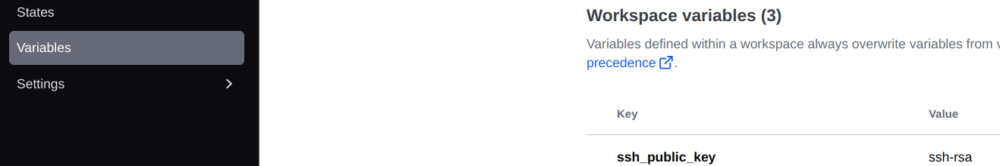

> This repository is a reboot of the [the_simple_api]( https://github.com/LucDelmon/the_simple_api) project. The main change being the use of a squash and merge strategy associated with semantic versioning instead of the git flow strategy with 2 branches. Also aiming for a better automation of the deployment process that will remove the need to preconfigure the server before deploying and try 
> to make full usage of all the new AI tools.

[](https://github.com/rubocop/rubocop)

[](https://rubystyle.guide)

[](https://GitHub.com/LucDelmon/the_simple_api_reboot/tags/)
[](https://GitHub.com/Naereen/LucDelmon/the_simple_api_reboot/commit/)
[](https://GitHub.com/LucDelmon/the_simple_api_reboot/commit/)

# Introduction
The goal of this project is to create the simplest API possible and add on top of it the most complex and complete CI/CD pipeline while applying best practices and add everything that a serious project should have.

The project is intended to be used as a reference for other projects and as a starting point for my own project.

It is required to have an aws account for the CD part.

# Best practises
- Commits follow the [Conventional commits](https://www.conventionalcommits.org/en/v1.0.0/) standard.
- Rubocop is present and a green light is required by the CI.

# Local Installation (development)

## Requirements
- Ruby version 3.3.0
- PostgresSQL with a user `rails` created, the password associated with this user must be added to the credentials file (`rails credentials:edit`) under the name `db_password`
- Redis installed locally

## Make it work
After cloning
- ./bin/setup
- rspec to launch the specs
- rails c to start a console
- rails s to start the server

# CI
The CI is done with GitHub actions and is composed of 1 workflow.

`ci.yml` that is triggered on every push to a branch. The CI checks the code with rubocop, brakeman, bundle-audit, runs the tests and checks the coverage. 

The semantic-release tool is also run to check if a new version should be released if the branch is main. If that's the case, the release is created on GitHub.

# CD
The CD is also done with GitHub actions. Is is triggered when a new release is created on GitHub (so ideally automatically when semantic-release creates a new release). 

# Deployment (Production)

I'm planning to test several deployments:
- EC2 + S3 + RDS + GA
- EC2 + S3 + RDS + GA + Capistrano
- Same but replacing terraform by cloud formation
- elastic beanstalk
- ECS with the best combo from the others

## Global prerequisites
#### 1. Database credentials
- use `EDITOR=nano rails credentials:edit --environment production` to set up the password for the production database. `db_password`= ..., 
- Commit the generated encrypted credentials file after this. 
- Remember the password since you will also have to set it when creating the DB.

#### 2. Adding the encryption key to AWS
- The previous step will generate a key in the `config/credentials/production.key` file. This file is ignored by git but needs to be added to AWS secret manager.

- In aws secret manager add the key, give it the name `credential_encryption_key`. Note the arn of the key.

#### 3. Buy a domain name
- You will need to have a domain name and admin access to the DNS configuration. You have to pay for that at a provider (or use a free one). You can also set-up route 53 in aws.

#### 4. Personal access token
- You will need a personal access token for sem ver. Go to your github settings, developer settings, personal access tokens and create a new token with the `repo`, `write:packages`, `admin:repo_hook` and `workflow authorisation`. Add it to you github secrets as `GH_TOKEN`.

# First Setup: EC2 + S3 + RDS via Terraform + github actions

from [9a0653cf47b80396f9ee5235a4911441a35a1fba](https://github.com/LucDelmon/the_simple_api_reboot/commit/9a0653cf47b80396f9ee5235a4911441a35a1fba)
Up to [54bf4b61931f78a02068915bd7b3b2b5462e7bec](https://github.com/LucDelmon/the_simple_api_reboot/commit/54bf4b61931f78a02068915bd7b3b2b5462e7bec)

This first setup try to stay minimal and only aim at deploying the app on one persistent server on EC2. The whole configuration is written as code in terraform and is meant to be deployed once. Once everything is set up, the CI/CD will take care of the continuous deployment via github actions.

On top of the EC2 the configuration contains:
- an S3 bucket to store the release files
- an RDS Postgres database to store the data
- An Elastic IP to have a fixed IP for the server even if you destroy and recreate it.
- A personal ssh access to the server using a ip whitelisting.
- An application load balancer allowing you to easily setup a certificate for your domain name.
- A github oidc to allow github actions to connect to aws without needing to store any credentials.
- A network configuration with 3 private subnets and 3 public subnets.
- Security groups, roles and policies to follow the best practices.

## Pros and Cons
### Pros
- You get a unique server that you can access via SSH on a unique ip. You can test your configurations like this before adding it to automation.
- You can scale the instance up easily by changing it's type then destroying and recreating it + trigger a new deployment.
- An easy playground

### Cons
- The server should be in a private subnet and not be open to ssh others than EC2 direct connect.
- The elastic IP address only usage is for the direct ssh access and could be removed if the server was in a private subnet.
- The configuration stays minimal and lack some basics, such as database backup, logs management, monitoring with cloudwatch, a CloudFront distribution, making an iam of the ec2.
- The database migration are runned with the new code while the server is running on the old one. This must be taken into account when deploying.
- No worker or service for Sidekiq yet.
- The puma concurrency env value is generated during the initiation of the ec2 instance. It can only be override in config/puma.rb so through a new deployment.
- The whole deploy script is also hard coded on the instance. It can be edited via ssh or by destroying and recreate the instance on terraform but it's not ideal. Ideal would be to have a tool like capistrano to manage the deployment.

## Terraform Configuration

Terraform is used to create the infrastructure on AWS. 
It is run locally but creates and manages resources in AWS. 
Terraform is idempotent, meaning you can run it multiple times; 
it will only create what's missing or update what has changed.

### 1. Prerequisites

#### 1.1 Install Terraform
- Install Terraform by following the instructions here: [Install Terraform CLI](https://learn.hashicorp.com/tutorials/terraform/install-cli).

#### 1.2 Set Up AWS IAM User for Terraform
- Create an AWS IAM user with no console access named `terraform_user`. This user will be used by Terraform.
- Do not add `terraform_user` to any group.
- Generate an access key and secret key for this user. You can do this in the AWS console under the IAM section.

#### 1.3 Create a Terraform Cloud Account
- Sign up for a Terraform Cloud account to store the state of your Terraform deployments: [Create an Account](https://developer.hashicorp.com/terraform/tutorials/cloud-get-started/cloud-sign-up#create-an-account).

#### 1.4 Obtain a Certificate for Your Domain
- Go to AWS Certificate Manager and create a certificate for your domain.
- Click on the certificate. It will be in the `Pending validation` state. Go to the domains tab. You will see a CNAME record.
- Validate the certificate by adding a CNAME record in your domain name provider's DNS settings. This may take a few minutes. (this step is required because I am not using aws route 53 that isn't free)

### 2. Configure Terraform

#### 2.1 Prepare Terraform Files
- Navigate to the Terraform configuration folder: `cd config/terraform`
- Update the terraform.cloud.organization value in main.tf to match your organization.

#### 2.2 Log in to Terraform Cloud
- Log in to Terraform Cloud: `terraform login`

### 3. AWS Configuration

#### 3.1 Set Up AWS Credentials in Terraform Cloud
- After initializing, a Terraform Cloud workspace will be created. Follow this guide to set `AWS_ACCESS_KEY_ID` and `AWS_SECRET_ACCESS_KEY` for your `terraform_user` as hidden variables: [Set Workspace Variables](https://developer.hashicorp.com/terraform/tutorials/aws-get-started/aws-remote#set-workspace-variables).

#### 3.2 Create an IAM Role for Terraform
- Create an IAM admin role in AWS that can be assumed by your `terraform_user`.
- Modify the trust relationship for this role to allow `terraform_user` to assume it. The trust relationship should be:

```json
  {
    "Version": "2012-10-17",
    "Statement": [
      {
        "Effect": "Allow",
        "Principal": {
          "AWS": "arn:aws:iam::YOUR_ACCOUNT_ID:user/terraform_user"
        },
        "Action": "sts:AssumeRole"
      }
    ]
  }
```

#### 4.1 Set Variables
- Variables required for the Terraform configuration can be found in the `variables.tf` file.
- You will need the arn of the resources created in the previous steps.
  - Production encryption key in AWS Secret Manager.
  - Certificate ARN from AWS Certificate Manager.
  - Admin role ARN in IAM for Terraform.
- These variables can be set in two ways (or a mix of the two):
  1. **Terraform Cloud Workspace:** Set the variables directly in the workspace.
  2. **Local File (`terraform.tfvars`):**
     - Copy the `terraform.tfvars.example` file to `terraform.tfvars`.
     - Fill in the required values, including sensitive information like passwords and keys.


  _Sensitive and shared variables should be set in the Terraform Cloud workspace since you can define them as sensitive variables.

### 5. Managing Infrastructure

#### 5.1 Create Infrastructure
- Create the infrastructure: `terraform apply`

#### 5.2 Update external DNS for Load Balancer
- After applying the infrastructure, you will receive an `alb_dns_name` in the output.
- Add a CNAME record in your domain name provider's DNS settings with this value. Validation may take a few minutes. (this step is required because I am not using aws DNS option route 53 that isn't free)

#### 5.3 Destroy Infrastructure
- To delete the entire infrastructure, run: `terraform destroy`
- To delete specific resources:
  - **App Server:**
    `terraform destroy -target=aws_instance.app_server`
  - **Database Server:**
    `    terraform destroy -target=aws_instance.db_server
    `

## GitHub Actions

GitHub Actions retrieves terraform values from aws ssm parameters. 

It uses [Github OIDC](https://github.com/aws-actions/configure-aws-credentials?tab=readme-ov-file#oidc) to connect to aws. All setup is done by terraform.

But minimals values needs to be set to allow github to connect to aws.

In the github repository, go to `/settings/variables/actions` and add the following variables :
- AWS_ROLE_ARN -> the arn of the admin role in IAM for Terraform. You will see it in terraform output as `github_actions_role_arn`
- AWS_REGION -> the region where the resources are created. `eu-north-1` by default.

When this is done all CI/CD will be able to connect to aws.

# Second Setup: Same as the first but trying to reduce the cons from the first setup

After first setup: 
- Create as many elastic IPS as subnets
- moving the server to a private subnet
- adding a NAT gateway to allow the server to connect to the internet for ssm
- Setting an instant connect endpoint to allow an access to the server from the aws console
- Setting up DB backup
- installing the cloudwatch agent on the server
- Adding a bunch of cloudwatch alarms linked to an sns
- The sns will send an email to the configured email address
- Add logs for the ALB (going to S3)
- Add logs for the RDS going to cloudwatch
- Add a cloudfront distribution in front of the ALB
- Recreate a certificate in us-east-1 for the cloudfront distribution
- Make the ALB communicate to the cloudfront via HTTP and remove HTTPS. Also remove the certificate
- Update security group to restrict ALB communication to the cloudfront
- Check different audit tools from aws to see if everything is ok
- Make a second certificate for the ALB. Allowing the ALB to communicate with the cloudfront via HTTPS
- Add a CNAME entry in my dns for the ALB

# Extras

## Network reminders
- A VPC (Virtual Private Cloud) is a logically isolated section of the AWS cloud where you can define and control a virtual network environment. It allows you to launch AWS resources, such as EC2 instances, within a defined network, providing control over IP address ranges, subnets, route tables, and security settings. Essentially, a VPC enables you to create a secure and customizable networking environment tailored to your application's needs.
- A VPC can have multiple security groups, which are defined configurations for controlling traffic. Instances are created within a VPC, and you must assign at least one security group to each instance to control its inbound and outbound traffic. Each instance can be associated with multiple security groups.
  - Security groups have multiples rules for inbound and outbound traffic.

## AWS configuration for using CLI

_Note: when using HCP terraform, the aws cli is not needed. The terraform cloud will take care of the infrastructure creation using an IAM admin user and communicate with aws itself_

### Setup
- First you need to install aws cli https://docs.aws.amazon.com/cli/latest/userguide/getting-started-install.html
- run `aws configure sso` once
  https://docs.aws.amazon.com/cli/latest/userguide/cli-configure-sso.html#cli-configure-sso-configure. Connect with an admin profile. When asked for CLI profile name. Use something easy to reuse like `deploy`

### Login
- run `aws sso login --profile deploy` to login to the aws account (this is temporary and need to be redone every hour, you can change this in the aws console but it can't be forever). This make your aws cli "session connected" for all following command
- To set variable like `AWS_ACCESS_KEY_ID`, `AWS_SECRET_ACCESS_KEY` use `eval "$(aws configure export-credentials --profile deploy --format env)"`

### Use
- You can now use the aws cli with the `deploy` profile. For example `aws ec2 describe-instances --profile deploy`

## Commands
- `sudo journalctl -u puma.service -f` to see the logs of the puma service (the rails server)
